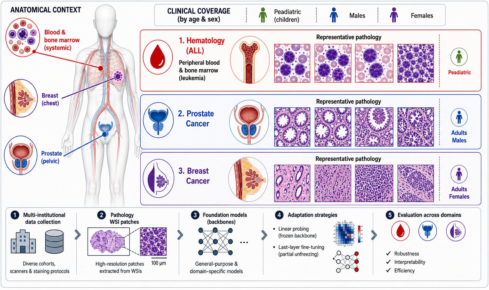
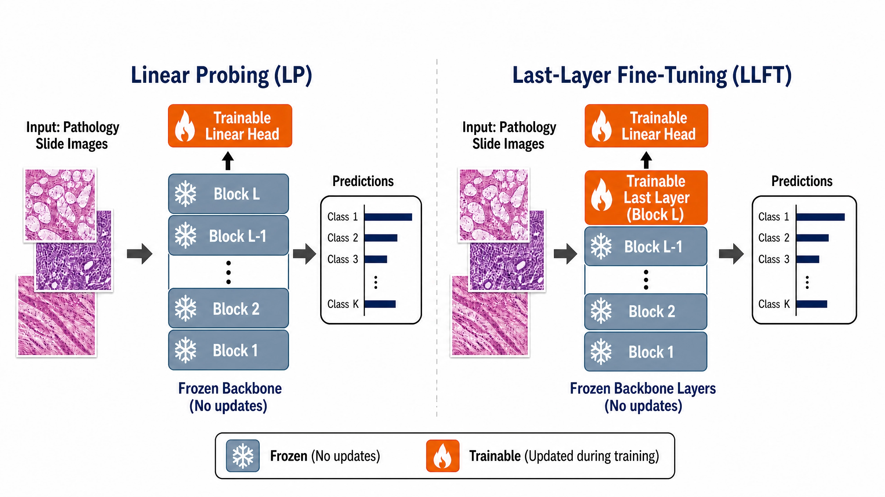

<p align="center">
  
</p>

<h1 align="center">Do Foundation Models Truly Outperform Domain-Specific Models? Evidence from Digital Pathology</h1>

<p align="center">
  <a href="https://www.mdpi.com/xxxx"></a>
  <a href="http://creativecommons.org/licenses/by/4.0/"></a>
</p>

## Overview

This repository contains the code and training/inference scripts used for benchmarking seven general-purpose pathology foundation models (FMs) and three domain-specific FMs across 11 patch-level datasets spanning three clinically relevant domains: pediatric hematology, prostate cancer, and breast cancer, using both linear probing and last-layer fine-tuning adaptation strategies. To contextualize the performance of pretrained FMs, a suite of five deep learning architectures trained from scratch on domain-specific data without any external pretraining were also benchmarked.  

## Repository Structure

- **`patho-fm/Linear-Probing`** — Training/testing FMs under a linear probing approach where pre-trained FMs served as fixed feature extractors with all backbone parameters frozen during training.
- **`patho-fm/Partial-FT`** — Training/testing FMs under a last-layer fine-tuning approach by updating the classification head together with the final trainable layer of each backbone, while all earlier layers remained frozen.
- **`patho-fm/Robustness-Check`** — Training FMs on a primary dataset and evaluating them on one/multiple external test datasets.
- **`patho-fm/DL-models`** — Training/testing a consistent set of standard computer vision backbones from scratch.
- **`assets/`** — Repository media.

  The difference between the model adaptation strategies: Linear Probing (LP) vs. Last-Layer Fine-Tuning (LLFT) is illustrated in the following:

<p align="center">
  
</p>

## Foundation models
- Hibou [[link]](https://huggingface.co/histai/hibou-b)
- Phikon-v2 [[link]](https://huggingface.co/owkin/phikon-v2)
- GigaPath [[link]](https://github.com/prov-gigapath/prov-gigapath)
- PathOrchestra [[link]](https://huggingface.co/AI4Pathology/PathOrchestra)
- UNI2-h [[link]](https://huggingface.co/MahmoodLab/UNI2-h)
- PLIP [[link]](https://github.com/pathologyfoundation/plip)
- CONCH [[link]](https://github.com/mahmoodlab/CONCH)
- RedDino [[link]](https://github.com/Snarci/RedDino)
- DINOBloom [[link]](https://github.com/marrlab/DinoBloom)
- HistoEncoder (Small, Medium) [[link]](https://github.com/jopo666/HistoEncoder)

## Deep learning models
  • ResNet-50
  • Vision Transformer 
  • Swin Transformer 
  • ConvNeXt-Base
  • DenseNet-121

## Datasets

- **`Hematology `**
  • Acute Lymphoblastic Leukemia (ALL) Dataset [[H1]](https://www.kaggle.com/datasets/mehradaria/leukemia) <br>
  • Peripheral Blood Cell Morphology Dataset [[H2]](https://data.mendeley.com/datasets/snkd93bnjr/1) <br>
  • High-Resolution White Blood Cell Datase [[H3]](https://springernature.figshare.com/articles/dataset/A_large-scale_high-resolution_WBC_image_dataset/22680517?file=40260787) <br>
  • AML and Non-malignant Leukocyte Dataset (TCIA) [[H4]](https://www.cancerimagingarchive.net/collection/aml-cytomorphology_lmu/) <br>
  
- **`Urology `**
  • P1 – SICAP-MIL [[P1]](https://github.com/jusiro/mil_histology) <br>
  • CrowdGleason [[P2]](https://zenodo.org/records/14178894) <br>
  • SICAPv2 [[P3]](https://data.mendeley.com/datasets/9xxm58dvs3/1) <br>
- **`Breast Cancer`**
  • BreakHis [[B1-B2]](https://www.kaggle.com/datasets/ambarish/breakhis) <br>
  • Kaggle Breast Histopathology Image [[B3]](https://www.kaggle.com/datasets/paultimothymooney/breast-histopathology-images) <br>
  • Zenodo HER2 Breast Cancer Dataset [[B4]](https://zenodo.org/records/8383580) <br>

  
## Citation

If you use these scripts in your research, please cite:

```bibtex
@article{chaima2026,
  title   = {Do Foundation Models Truly Outperform Domain-Specific Models? Evidence from Digital Pathology},
  author  = {Ben Rabah, Chaima and Serag, Ahmed},
  journal = {MAKE},
  year    = {2026},
  url     = {xxxxx}
}
```

## License

Released under the [Creative Commons Attribution 4.0 International (CC BY 4.0)](http://creativecommons.org/licenses/by/4.0/) license.
